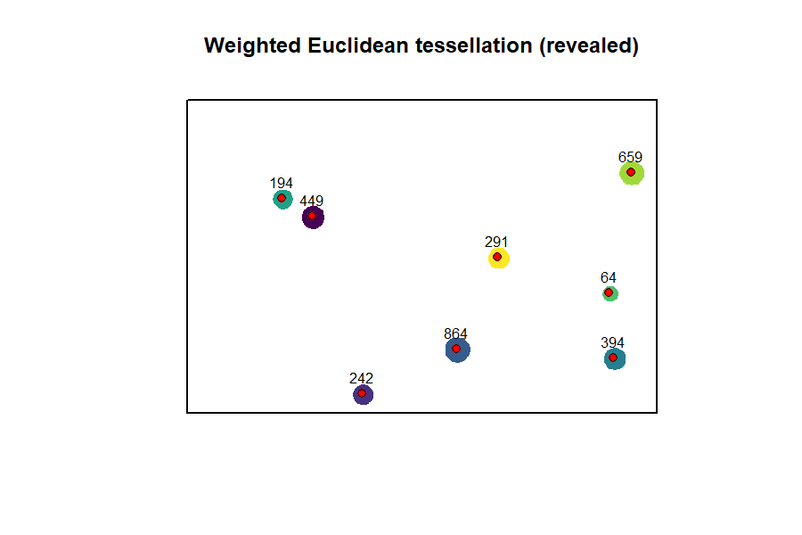
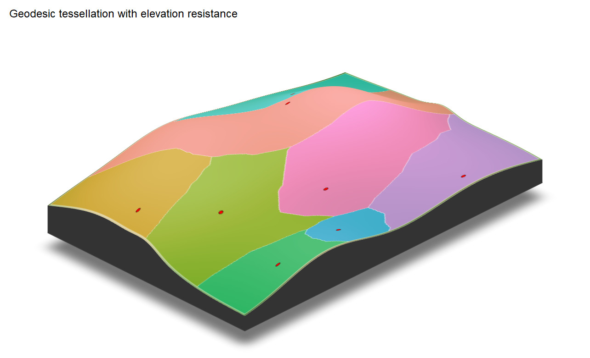

<!-- README.md is generated from README.Rmd. Please edit README.Rmd. -->

```{r fig-main, echo=FALSE, out.width="100%"}
knitr::include_graphics("man/figures/fig-main.png")
```

# weightedVoronoi

Tools for weighted spatial tessellation using Euclidean and geodesic distances within constrained polygons. Produces complete, connected partitions that respect complex boundaries and heterogeneous point weights.

🌐 Website: https://HarriRaven.github.io/weightedVoronoi/

```{r animation, echo=FALSE, out.width="100%"}

```

## Installation
```r
install.packages(“remotes”)

remotes::install_github(“HarriRaven/weightedVoronoi”)

library(sf) library(weightedVoronoi)
```
### Use a projected CRS (units in metres)
```r
crs_use \<- 32636
```
### Domain polygon (simple rectangle for speed)
```r
boundary_sf <- st_sf(
  geometry = st_sfc(
    st_polygon(list(rbind(
      c(0, 0),
      c(1000, 0),
      c(1000, 1000),
      c(0, 1000),
      c(0, 0)
    )))
  ),
  crs = crs_use
)
```

### Generator points with weights
```r
points_sf <- st_sf(
  village = paste0("V", 1:5),
  population = c(50, 200, 1000, 150, 400),
  geometry = st_sfc(
    st_point(c(200, 200)),
    st_point(c(800, 250)),
    st_point(c(500, 500)),
    st_point(c(250, 800)),
    st_point(c(750, 750))
  ),
  crs = crs_use
)
```

#### Weighted Euclidean tessellation
```r
out_euc <- weighted_voronoi_domain(
  points_sf = points_sf,
  weight_col = "population",
  boundary_sf = boundary_sf,
  res = 20,
  weight_transform = log10,
  distance = "euclidean",
  verbose = FALSE
)
```

#### Weighted geodesic tessellation (domain-constrained shortest path distance)
```r
out_geo <- weighted_voronoi_domain(
  points_sf = points_sf,
  weight_col = "population",
  boundary_sf = boundary_sf,
  res = 20,
  weight_transform = log10,
  distance = "geodesic",
  close_mask = TRUE,
  close_iters = 1,
  verbose = FALSE
)
```

##### Terrain-aware tessellations

`weightedVoronoi` supports geodesic tessellations that incorporate environmental
resistance. When supplied with an elevation raster, distances are modified using
Tobler’s hiking function, allowing topography to influence spatial allocation.

###### Flat domain (no resistance)

```{r fig-flat-3d, echo=FALSE, out.width="100%"}
knitr::include_graphics("man/figures/fig-flat-3d.png")
```

###### Elevation-dependent resistance

```{r fig-dem-3d, echo=FALSE, out.width="100%"}

```

### Inspect outputs
```r
names(out_euc)

head(out_euc$summary)

out_euc$diagnostics
```
# Outputs

weighted_voronoi_domain() returns:

- polygons: sf object with one polygon per generator (and attributes)

- allocation: terra::SpatRaster assigning each raster cell to a
  generator

- summary: generator-level summary table (area, share, weights, etc.)

- diagnostics: diagnostics and settings (coverage, unreachable fraction
  for geodesic, etc.)

# Notes

- Inputs must be in a projected CRS with metric units (e.g. metres).

- res controls the raster resolution and therefore the trade-off between
  speed and boundary fidelity.

- Geodesic tessellations are typically slower than Euclidean
  tessellations because shortest-path distances are computed within the
  domain.

## Citation

If you use weightedVoronoi, please cite the associated software note:

```r
bibentry(
  bibtype = "Manual",
  title = "weightedVoronoi: Weighted Spatial Tessellations Using Euclidean and Geodesic Distances",
  author = person("Harri", "Ravenscroft"),
  year = "2026",
  note = "R package version 0.1.0",
  url = "https://github.com/HarriRaven/weightedVoronoi"
)
```

<!-- badges: start -->

[](https://github.com/HarriRaven/weightedVoronoi/actions/workflows/R-CMD-check.yaml)

<!-- badges: end -->
