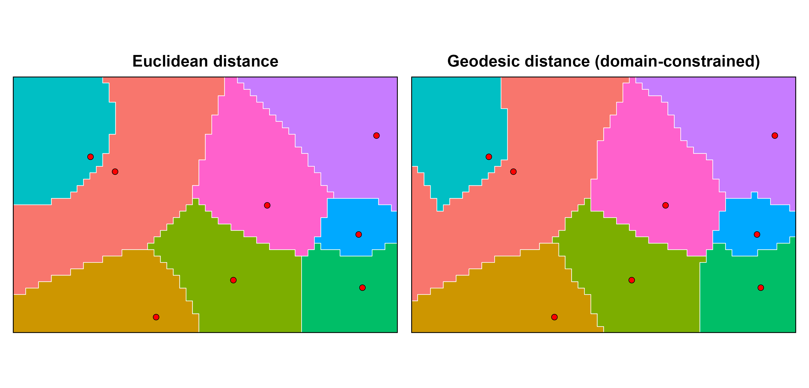
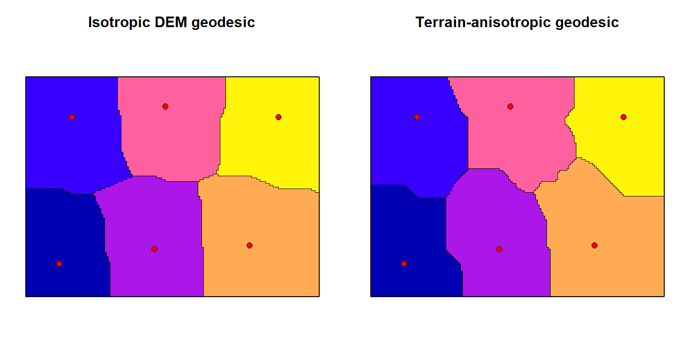
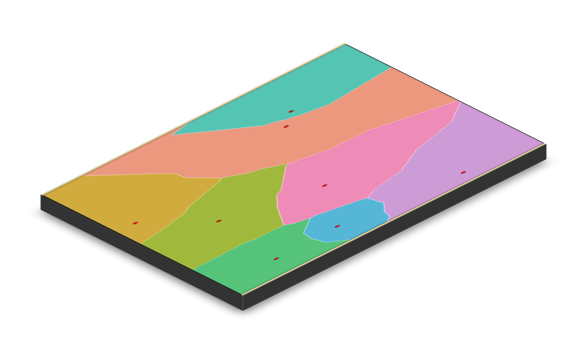

<!-- README.md is generated from README.Rmd. Please edit README.Rmd. -->



# weightedVoronoi

Tools for weighted spatial tessellation in constrained domains using
Euclidean and geodesic distances. Produces complete, connected
partitions that respect complex boundaries, heterogeneous point weights,
resistance surfaces, and temporal or uncertainty-aware workflows.

🌐 Website: <https://HarriRaven.github.io/weightedVoronoi/>


## Key Features

1)  Weighted Euclidean and geodesic tessellations inside arbitrary
    polygon domains

2)  Flexible weight semantics via weight_model and weight_power

3)  Custom resistance surfaces and barriers via compose_resistance() and
    add_barriers()

4)  Terrain-informed geodesic allocation via DEM/Tobler resistance

5)  Terrain-anisotropic geodesic tessellations

6)  Scalable multisource geodesic allocation for additive isotropic
    geodesics

7)  Uncertainty-aware tessellations with probability and entropy outputs

8)  Temporal tessellation stacks with change and persistence maps

## Installation

``` r
install.packages("remotes")
remotes::install_github("HarriRaven/weightedVoronoi")

library(sf)
library(terra)
library(weightedVoronoi)
```

### Use a projected CRS (units in metres)

``` r
crs_use \<- 32636
```

### Domain polygon (simple rectangle for speed)

``` r
boundary_sf <- st_sf(
  geometry = st_sfc(
    st_polygon(list(rbind(
      c(0, 0),
      c(1000, 0),
      c(1000, 1000),
      c(0, 1000),
      c(0, 0)
    )))
  ),
  crs = crs_use
)
```

### Generator points with weights

``` r
points_sf <- st_sf(
  village = paste0("V", 1:5),
  population = c(50, 200, 1000, 150, 400),
  geometry = st_sfc(
    st_point(c(200, 200)),
    st_point(c(800, 250)),
    st_point(c(500, 500)),
    st_point(c(250, 800)),
    st_point(c(750, 750))
  ),
  crs = crs_use
)
```

#### Weighted Euclidean tessellation

``` r
out_euc <- weighted_voronoi_domain(
  points_sf = points_sf,
  weight_col = "population",
  boundary_sf = boundary_sf,
  res = 20,
  weight_transform = log10,
  distance = "euclidean",
  # optional: alternative weight behaviour
  weight_model = "multiplicative",
  verbose = FALSE
)
```

#### Weighted geodesic tessellation (domain-constrained shortest path distance)

``` r
out_geo <- weighted_voronoi_domain(
  points_sf = points_sf,
  weight_col = "population",
  boundary_sf = boundary_sf,
  res = 20,
  weight_transform = log10,
  distance = "geodesic",
  close_mask = TRUE,
  close_iters = 1,
  verbose = FALSE
)
```

The package also supports uncertainty-aware and temporal workflows; see
the vignette for worked examples.

### Custom Resistance and Barriers

Build a resistance surface on the same grid, optionally combine layers,
then apply barriers before running a geodesic tessellation.

``` r
# Use the Euclidean allocation grid as a convenient template
template <- out_euc$allocation

# Base resistance (all 1)
R <- template
terra::values(R) <- 1

# Add a high-friction vertical band (e.g., dense vegetation)
xy <- terra::xyFromCell(R, 1:terra::ncell(R))
band <- xy[,1] > 450 & xy[,1] < 550
vals <- terra::values(R)
vals[band] <- 25
terra::values(R) <- vals

# Add a semi-permeable river barrier (vector line)
river <- st_sf(
  geometry = st_sfc(st_linestring(rbind(c(500, 0), c(500, 1000)))),
  crs = st_crs(boundary_sf)
)

# Tip: for coarse rasters, use width ~ res/2 or res
R2 <- add_barriers(R, river, permeability = "semi", cost_multiplier = 20, width = 20)

out_geo_res <- weighted_voronoi_domain(
  points_sf = points_sf,
  weight_col = "population",
  boundary_sf = boundary_sf,
  res = 20,
  weight_transform = log10,
  distance = "geodesic",
  resistance_rast = R2,
  verbose = FALSE
)
```

#### Terrain-aware tessellations

Environmental resistance and terrain can strongly influence spatial
allocation.

The example below shows how terrain anisotropy (direction-dependent
movement cost) can substantially alter geodesic tessellations compared
to isotropic resistance.

Unlike isotropic resistance, terrain-anisotropic geodesic tessellations
allow uphill and downhill movement to differ, producing
direction-dependent allocation patterns.



##### Flat domain (no resistance)



##### Elevation-dependent resistance


### Inspect outputs

``` r
names(out_euc)

head(out_euc$summary)

out_euc$diagnostics
```

# Outputs

weighted_voronoi_domain() returns:

- polygons: sf object with one polygon per generator (and attributes)

- allocation: terra::SpatRaster assigning each raster cell to a
  generator

- summary: generator-level summary table (area, share, weights, etc.)

- diagnostics: diagnostics and settings (coverage, unreachable fraction
  for geodesic, etc.)

# Notes

- Inputs must be in a projected CRS with metric units (e.g. metres).

- res controls the raster resolution and therefore the trade-off between
  speed and boundary fidelity.

- Geodesic tessellations are typically slower than Euclidean
  tessellations because shortest-path distances are computed within the
  domain.

## Citation

If you use weightedVoronoi, please cite the associated software note:

``` r
bibentry(
  bibtype = "Manual",
  title = "weightedVoronoi: Weighted Spatial Tessellations Using Euclidean and Geodesic Distances",
  author = person("Harri", "Ravenscroft"),
  year = "2026",
  note = "R package version 1.1.0",
  url = "https://github.com/HarriRaven/weightedVoronoi"
)
```

<!-- badges: start -->

[](https://github.com/HarriRaven/weightedVoronoi/actions/workflows/R-CMD-check.yaml)

<!-- badges: end -->
