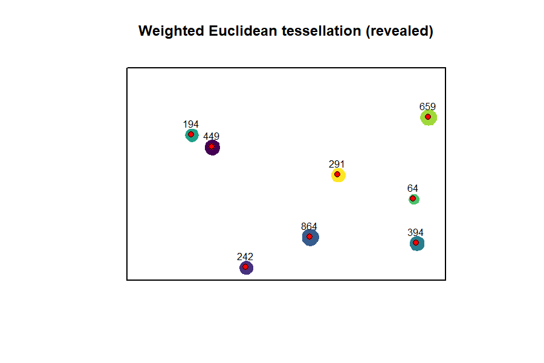
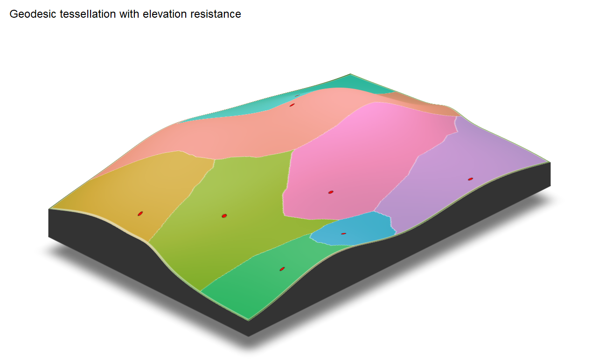

# weightedVoronoi


**weightedVoronoi** generates weighted spatial partitions that respect
boundaries, landscape structure, and heterogeneous point influence using
Euclidean or geodesic distance.

🌐 Website: <https://HarriRaven.github.io/weightedVoronoi/>



## Key Features

1.  Weighted Euclidean and geodesic tessellations inside arbitrary
    polygon domains

2.  Flexible weight semantics via weight_model and weight_power

3.  Custom resistance surfaces and barriers via
    [`compose_resistance()`](https://HarriRaven.github.io/weightedVoronoi/reference/compose_resistance.md)
    and
    [`add_barriers()`](https://HarriRaven.github.io/weightedVoronoi/reference/add_barriers.md)

4.  Terrain-informed geodesic allocation via DEM/Tobler resistance

5.  Terrain-anisotropic geodesic tessellations

6.  Scalable multisource geodesic allocation for additive isotropic
    geodesics

7.  Uncertainty-aware tessellations with probability and entropy outputs

8.  Temporal tessellation stacks with change and persistence maps

## Interactive demo

Explore weighted Voronoi tessellations interactively:

👉 <https://harriraven.shinyapps.io/weightedVoronoi-demo/>

- Compare Euclidean vs geodesic allocation
- Add resistance surfaces and terrain effects
- Visualise how domain geometry constrains influence

## Choosing a workflow

weightedVoronoi supports several spatial tessellation approaches
depending on your assumptions about distance, landscape structure, and
analysis goals.

### Quick guide:

Straight-line influence (fastest) → `distance = "euclidean"`

Constrained by domain geometry (no crossing gaps/barriers) →
`distance = "geodesic"`

Landscape affects movement (e.g. terrain, land cover) → provide
`resistance_rast` or `dem_rast`

Uphill vs downhill matters (directional movement) →
`anisotropy = "terrain"`

Repeated runs (uncertainty or time series) → use
`prepare_geodesic_context() + geodesic_engine = "multisource"`

Uncertain weights →
[`weighted_voronoi_uncertainty()`](https://HarriRaven.github.io/weightedVoronoi/reference/weighted_voronoi_uncertainty.md)

Time series of tessellations →
[`weighted_voronoi_time()`](https://HarriRaven.github.io/weightedVoronoi/reference/weighted_voronoi_time.md)

For a more detailed guide, see the vignette.

## Installation

``` r
install.packages("remotes")
remotes::install_github("HarriRaven/weightedVoronoi")

library(sf)
library(terra)
library(weightedVoronoi)
```

### Use a projected CRS (units in metres)

``` r
crs_use \<- 32636
```

### Domain polygon (simple rectangle for speed)

``` r
boundary_sf <- st_sf(
  geometry = st_sfc(
    st_polygon(list(rbind(
      c(0, 0),
      c(1000, 0),
      c(1000, 1000),
      c(0, 1000),
      c(0, 0)
    )))
  ),
  crs = crs_use
)
```

### Generator points with weights

``` r
points_sf <- st_sf(
  village = paste0("V", 1:5),
  population = c(50, 200, 1000, 150, 400),
  geometry = st_sfc(
    st_point(c(200, 200)),
    st_point(c(800, 250)),
    st_point(c(500, 500)),
    st_point(c(250, 800)),
    st_point(c(750, 750))
  ),
  crs = crs_use
)
```

#### Weighted Euclidean tessellation

``` r
out_euc <- weighted_voronoi_domain(
  points_sf = points_sf,
  weight_col = "population",
  boundary_sf = boundary_sf,
  res = 20,
  weight_transform = log10,
  distance = "euclidean",
  # optional: alternative weight behaviour
  weight_model = "multiplicative",
  verbose = FALSE
)
```

#### Weighted geodesic tessellation (domain-constrained shortest path distance)

``` r
out_geo <- weighted_voronoi_domain(
  points_sf = points_sf,
  weight_col = "population",
  boundary_sf = boundary_sf,
  res = 20,
  weight_transform = log10,
  distance = "geodesic",
  close_mask = TRUE,
  close_iters = 1,
  verbose = FALSE
)
```

The package also supports uncertainty-aware and temporal workflows; see
the vignette for worked examples.

#### Fast workflows with prepared context

``` r
ctx <- prepare_geodesic_context(...)

weighted_voronoi_domain(..., prepared = ctx)
```

Fast reuse currently supported in:

``` r
weighted_voronoi_domain(..., prepared = ctx)
```

Temporal and uncertainty workflows automatically reuse internal
preparation and do not currently accept external prepared contexts

##### Reusing Geodetic Contexts

``` r
ctx <- prepare_geodesic_context(
  boundary_sf = boundary_sf,
  res = 20,
  geodesic_engine = "multisource"
)

# Now reuse for many runs (fast)
out1 <- weighted_voronoi_geodesic(
  points_sf = points_t1,
  weight_col = "population",
  prepared = ctx
)

out2 <- weighted_voronoi_geodesic(
  points_sf = points_t2,
  weight_col = "population",
  prepared = ctx
)
```

This avoids rebuilding the geodesic graph and can substantially speed up
repeated runs (e.g. temporal or uncertainty workflows).

### Custom Resistance and Barriers

Build a resistance surface on the same grid, optionally combine layers,
then apply barriers before running a geodesic tessellation.

``` r
# Use the Euclidean allocation grid as a convenient template
template <- out_euc$allocation

# Base resistance (all 1)
R <- template
terra::values(R) <- 1

# Add a high-friction vertical band (e.g., dense vegetation)
xy <- terra::xyFromCell(R, 1:terra::ncell(R))
band <- xy[,1] > 450 & xy[,1] < 550
vals <- terra::values(R)
vals[band] <- 25
terra::values(R) <- vals

# Add a semi-permeable river barrier (vector line)
river <- st_sf(
  geometry = st_sfc(st_linestring(rbind(c(500, 0), c(500, 1000)))),
  crs = st_crs(boundary_sf)
)

# Tip: for coarse rasters, use width ~ res/2 or res
R2 <- add_barriers(R, river, permeability = "semi", cost_multiplier = 20, width = 20)

out_geo_res <- weighted_voronoi_domain(
  points_sf = points_sf,
  weight_col = "population",
  boundary_sf = boundary_sf,
  res = 20,
  weight_transform = log10,
  distance = "geodesic",
  resistance_rast = R2,
  verbose = FALSE
)
```

#### Terrain-aware tessellations

Environmental resistance and terrain can strongly influence spatial
allocation.

The example below shows how terrain anisotropy (direction-dependent
movement cost) can substantially alter geodesic tessellations compared
to isotropic resistance.

Unlike isotropic resistance, terrain-anisotropic geodesic tessellations
allow uphill and downhill movement to differ, producing
direction-dependent allocation patterns.


##### Flat domain (no resistance)


##### Elevation-dependent resistance



### Inspect outputs

``` r
names(out_euc)

head(out_euc$summary)

out_euc$diagnostics
```

# Outputs

weighted_voronoi_domain() returns:

- polygons: sf object with one polygon per generator (and attributes)

- allocation: terra::SpatRaster assigning each raster cell to a
  generator

- summary: generator-level summary table (area, share, weights, etc.)

- diagnostics: diagnostics and settings (coverage, unreachable fraction
  for geodesic, etc.)

# Notes

- Inputs must be in a projected CRS with metric units (e.g. metres).

- res controls the raster resolution and therefore the trade-off between
  speed and boundary fidelity.

- Geodesic tessellations are typically slower than Euclidean
  tessellations because shortest-path distances are computed within the
  domain.

## Citation

If you use weightedVoronoi, please cite the associated software note:

``` r
bibentry(
  bibtype = "Manual",
  title = "weightedVoronoi: Weighted Spatial Tessellations Using Euclidean and Geodesic Distances",
  author = person("Harri", "Ravenscroft"),
  year = "2026",
  note = "R package version 1.1.0",
  url = "https://github.com/HarriRaven/weightedVoronoi"
)
```
